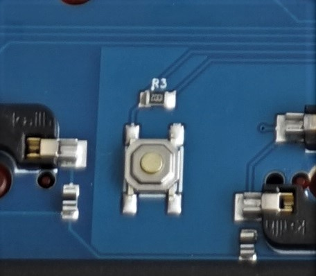
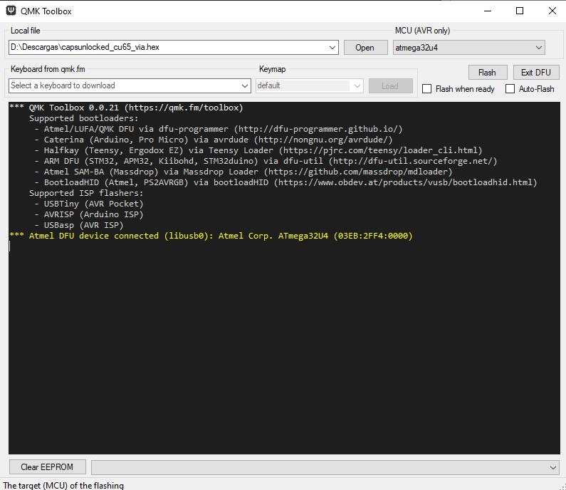
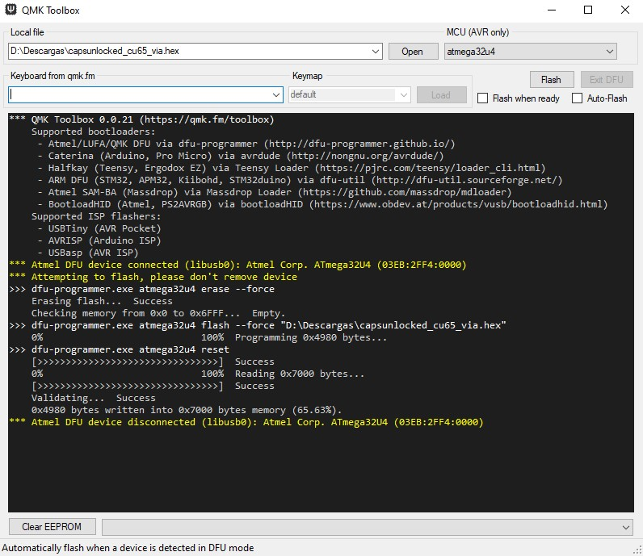
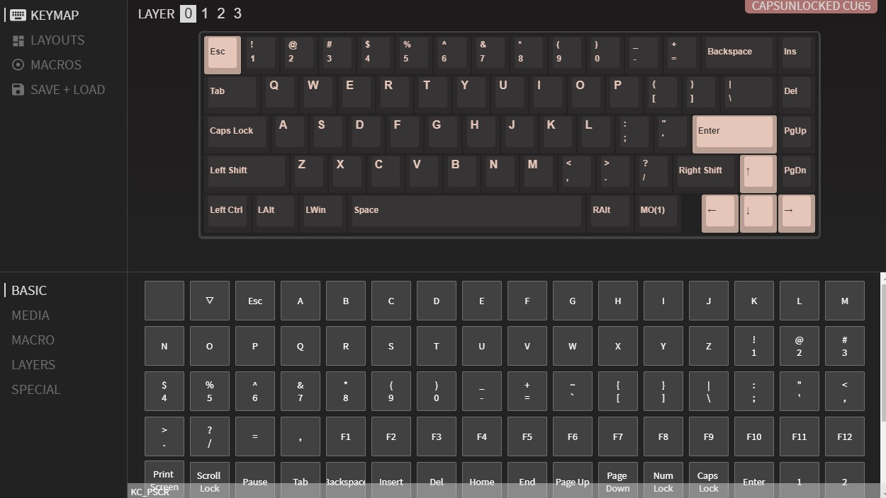

  * [Content of the package](#content-of-the-package)
  * [What do you need?](#what-do-you-need?)
  * [Mount guide](#mount-guide)
  * [Flash guide](#flash-guide)

This guide is based on the @maz0r 's [CU-80 guide](https://github.com/maz0r/cu80-flashguide)

# Welcome to the CU65 Readme!

## Content of the package

 - 10 flat screws
 - 10 round screws
 - 3 big screws
 -  About 17 washers
 - Back Case
 - Front Case
 - Foam layer
 - PCB
 - Footbar
 - 2 Foot stickers

## What do you need?
### ISO
- 6.25u or 7u Stab for spacebar.
- 2u stab for Backspace.
- 2u stab for Enter key.
- About 68 Switch keys.
- USB C cable.
- A star screwdriver
- A 2.5mm hex key
- (Optional) Some lube for switch keys and stabs like Krytox 205G0 or Trybosys 3204

### ANSI
- 1x  6.25u or 7u Stab for spacebar.
- 2u stab for Backspace.
- 2u stab for Enter key.
- 2u stab for Left Shift key.
- About 67 Switch keys.
- USB C cable.
- A star screwdriver
- A 2.5mm hex key
- (Optional) Some lube for switch keys and stabs like Krytox 205G0 or Trybosys 3204

## Mount guide
- Put off the back case and the white foam.
- Put off the PCB, is very tight. I suggest push from opposite side of the USB side, where are going to be the Ins, Del, PgUp, PgDn keys. When you put off the PCB from this tight stand off is much easy to get it.
- I suggest to connect the PCB to your PC and flash VIA Firmware. You can follow the instructions from the chapter for flash guide.
- Now you can test Hotswap switches connections with some tweezers or a clip and with the key tester of VIA(if yopu flashed it) or some software like EK Switch Hitter.
- Its time to put and screw the stabs.
- Now you can put the PCB on the front case. Put in its place first the USB C connector and the and the align the holes for the standoffs.
- Now you can put your stabs switches from the front case. I suggest you to hold the hotswap socket when you push the switch so as not to break them.
- Put some keycaps to the stabs and **test them before put all the switch keys** .
- Now you can put the rest of your favourites switches from the front case. Remember to hold the hotswap socket when you push the switch so as not to break them.
- Use 7 rounded screws and washers to screw the PCB to thev front case. At this image you cand found where is the holes for this screws.

- You can test again the switches.
- Screw the footbar to the back case with the 3 big screws.
- Put the foam layer and the back case. And screw the back case to the front case with 7 flat screws.
- (Optional)Use your 2 foam stickers, one at the back case and other to the footbar.
- Finally put your favourite keycaps to your switches and enjoy your CU65 Keyboard.

## Flash guide
### Software
- Install QMK Toolbox, open it and will install some USB drivers you will need. You can get it from https://github.com/qmk/qmk_toolbox/releases
- I would recommend install VIA software too, you will need to flash it only once and you can change the keyboard layout without  flash it. https://github.com/the-via/releases/releases
- You can make your own layout with QMK Configurator and flash it if your prefer too.
### Firmware files

**RIGHT CLICK SAVE AS!!**
|Firmware Type |Layout|Link|
|:---|:---|:---|
| VIA| ANSI/ISO|[Link](hexfiles/capsunlocked_cu65_via.hex)

You can make your own hexfile at [QMK Configurator](https://config.qmk.fm/#/)

### Getting ready to flash

- Connect your keyboard
- Launch QMK Toolbox

#### Select firmware to flash

In QMK Toolbox select Open & navigate to your .hex file and click open.
#### Enter DFU (device firmware upgrade) mode

This mode will persist until firmware is flashed or keyboard power is cycled unless no firmware is present.

##### Stock firmware
 - Use [Hardware Reset](#hardware-reset).

##### VIA Firmware

 - If the keyboard is functional.
   - FN + ESC will reboot into DFU mode.
 - If not use the [Bootmagic](#bootmagic-firmware) method.

##### Bootmagic Firmware

 - Disconnect the USB from the keyboard.
 - Reconnect the USB cable while holding ESC on the keyboard.
##### Hardware Reset

 - Remove the backplate.
 - Plug in the keyboard.
 - Press the physical reset button on the back of the PCB

 
 
#### Verify you are in Bootloader Mode

If you have successfully entered bootloader mode, the keyboard should disconnect and reconnect (you may hear a sound in windows) 

Shortly after re-connecting you should see a yellow line appear in your QMK Toolbox window as per the below image.

If you have a different message check out the [Zadig](https://docs.qmk.fm/#/driver_installation_zadig) troubleshooting steps on the QMK site.

**for MacOS users you may have to tick the "Auto Flash Firmware" button for the device to be detected by QMK Toolkit!**

### Clearing the EEPROM

It's recommended that you clear the EEPROM if you're having any weird issues with any firmware you try, especially VIA-based firmwares. They store their configuration in spare EEPROM space, so clearing it will let the board start from a known good place so you can set it up again. Use the _Clear EEPROM_ button in the bottom left of the QMK Toolbox UI to do that, then flash a firmware again straight afterwards as Toolbox asks you to!

### Flash the firmware

Click flash!

On completion the keyboard should disconnect and begin <u>functioning</u> as per its new firmware.

At QMK Toolbox you will see something like this if all went OK.

## Configuration using VIA

### Setup
- Download [VIA](https://github.com/the-via/releases/releases/latest)
- Launch VIA

### Basic VIA Configuration (like real basic)

Once your keyboard has been detected in VIA, you should be presented with the following screen.

From here you can edit most functions of the keyboard from creating macros to rebinding layers.
You can edit any key clicking on it on the top keyboard image and then click the new key value from the bottom section.
From the left Layout section you can edit your layout to use ISO or ANSI layout.
My first change was exchange the Left Windows and Left Alt keys.
